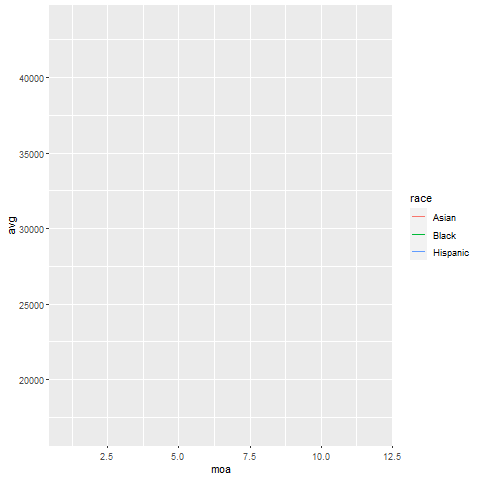

```{r setup, include=FALSE, purl=FALSE}
options(htmltools.dir.version = FALSE, width = 70)
knitr::opts_chunk$set(comment = "##")
```

```{r xaringan-themer, include=FALSE, warning=FALSE, purl=FALSE}
library(xaringanthemer)
style_mono_accent(
  base_color = "#B49C55",
  header_font_google = google_font("Josefin Sans"),
  text_font_google   = google_font("Montserrat", "300", "300i"),
  code_font_google   = google_font("Fira Mono")
)
```

---
# Objective of the Study 
### - To Understand The Composition of Of Color Patients within Providers
### - To Understand The Characteristics That Make Up This Population
### - To Understand The Reasoning of Visits by These Patients

---
# Subjects of the Study
## - Data from three Rhode Island specialty hospitals, Bradley, Butler, and Rehabilitation includes features such as Age, Sex, Race, Providers, Service, etc.
### - This data was segmented for year of discharge of 2018 and Race feature had unknowns and blank removed for the sake of the analysis

---
class: inverse
# Illustration 1: Percentage of Patients by Race,
#### White patients make up a total of about 62% of all visits

---
class: inverse
# Illustration 2: Number of Color Patients by Provider
#### Rhode Island Hospital, Women and Infants and Meriam had the highest


---
class: inverse
# Illustration 3: Number of Color Patients by Sex
#### About equal for Black patients, more female for Hispanics


---
class: inverse
# Illustration 4: Average Age for Of-Color Patients
#### On average, Black patients tend to be older


---
class: inverse
# Illustration 5: Average Length of Stay for Of-Color Patients
#### On average, Black patients to stay longer when going to providers


---
class: inverse
# Illustration 6: Average Total Pay for Of-Color Patients
#### On aveage, Black patients tend to pay more than counterparts


---
class: inverse
# Illustration 7: Payer Type by Of-Color Patients
#### A majority of patients of color have dues pay by Medicare


---
class: inverse
# Illustration 8: Admission Type by Of-Color Patient
#### Patients of color tend to be admitted on emergency or urgent type


---
class: inverse
# Illustration 9: Number of Patients by Month
#### Spike within the months of March to May for Hispanic and Black patients


---
class: inverse
# Illustration 10: Number of Patients by Season
#### Drop within the summer months for Hispanic and Black patients


---
class: inverse
# Illustration 11: Total Pay by Month
#### Alot of volatility amongst Asian and Black payout

---
# Predictive Modelling 
## Two models were ran under this data.....
#### Model 1: Predictive if patient will have low/high total cost based on median
#### Model 2: Predictive if patient of color based on same characteristics

---
class: inverse
# Model 1


---
class: inverse
# Model 2


---
# Errors and Challenges
### 1. Error from Graphing
### 2. Training the Models
### 3. Prepping the Data


---